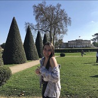

# Alyssa Bardeau

## À propos de moi
Étudiante en Information Communication dans les Organisations, je suis spécialisée dans le community management.

## Formation
- **2023:** BUT Information Numérique dans les Organisations, IUT Bordeaux Montaigne.
- **2021:** Bac Technologique RH, Lycée Général et Technologique Odilon Redon, Pauillac.

## Expériences professionnelles
- **2022:** Stage chez [Yoga in the City](#), rédaction d'article, création de mooboard...
- **juillet-août 2022:** CDD - Job étudiant [Super U](#), Mise en rayon, Accueil des clients, Caisse et Inventaire...
- **2023:** Stage chez [Yoga in the City](#), rédaction d'article, création de podcats, gestion de Pinterest, création de contenus...
- **2023-2024:** Alternance chez [Noé Santé](#), création de contenus, rédaction, création d'infographies...

## Compétences
- Rédaction web
- Gestion des réseaux
- Outils de communication
- Wordpress
- Canva et Photopea
- ...

## Langues
- Français

## Loisirs
- Lecture
- Voyage
- Site internet et réseaux sociaux
- Bénévole dans une association pour les animaux

## Contact
- Email: alyssa.bardeau@outlook.com
- LinkedIn: [Alyssa Bardeau]([https://www.linkedin.com/in/monprofil/]
